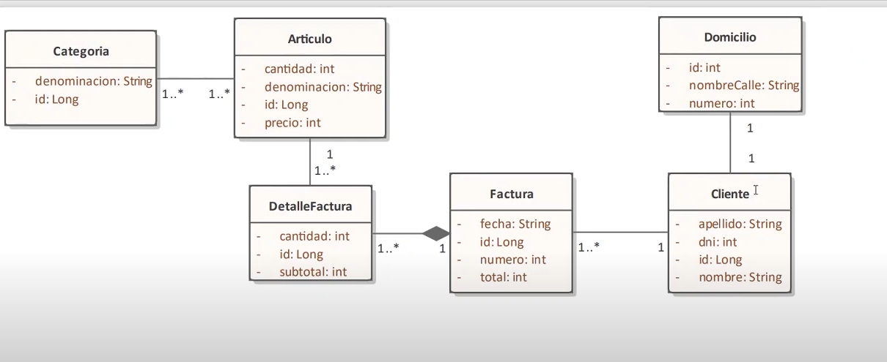

Comenzamos a estudiar JPA y la implementación con Hibernate. (Proyecto de base )
1- Descargar el proyecto   
2- Abrir en Intelligent Idea Community  
3 -Este Proyecto utiliza gradle y la base de dato H2 en memoria para simplificar 
4 - Agregamos Lombok para que maneje los Getters y Setters y el patrón BUILDER 
5- Diagrama de clases a implementar  
6- AGREGAMOS ENVERS PARA AUDITAR CAMBIOS EN LA DB

